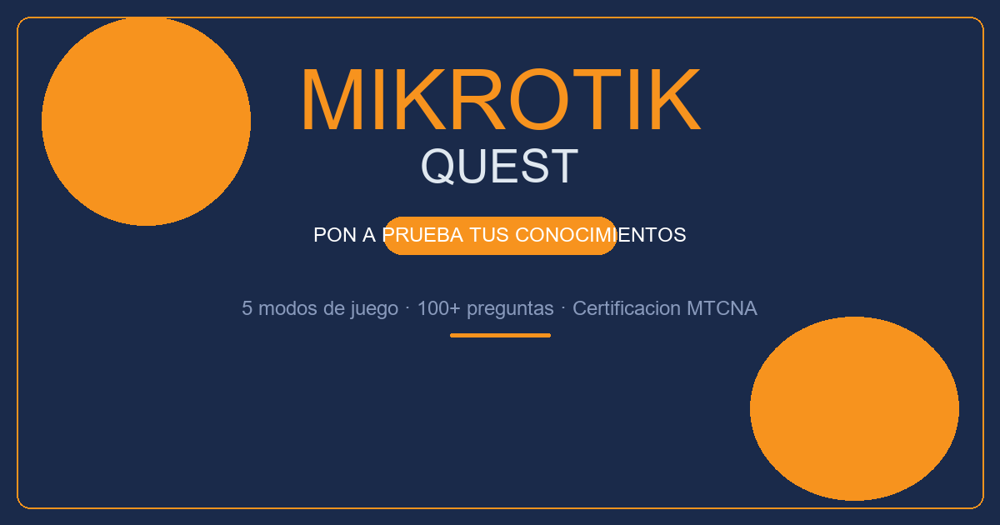

# MikroTik Quest 🎯



Quiz educativo interactivo basado en el **Curso Completo MikroTik** del Ing. Alexis Uranga. Pon a prueba tus conocimientos para la certificación **MTCNA** con 5 modos de juego.

---

## 🎮 Modos de juego

| Modo | Pts | Descripción |
|------|-----|-------------|
| **Quiz** | 10 | Preguntas de opción múltiple |
| **True/False** | 5 | Afirmaciones para calificar como verdaderas o falsas |
| **Word Scramble** | 15 | Ordena las letras para formar la palabra correcta |
| **Fill-in** | 10 | Completa la frase con la palabra faltante |
| **Case Scenarios** | 20 | Escenarios prácticos del mundo real |

## ⚡ Sistema de puntuación

- **Racha x2**: +5 pts extra
- **Racha x3+**: +10 pts extra
- Cada modo otorga puntos base distintos
- La racha máxima se registra y muestra al final

## 🚀 Cómo ejecutar

### Windows
```bat
start index.html
```
o haz doble clic en `run.bat`.

### Linux / macOS
```sh
xdg-open index.html
```
o ejecuta `./run.sh`.

## 📁 Estructura del proyecto

```
mikrotik/
├── index.html           ← Juego principal
├── run.bat              ← Lanzador Windows
├── run.sh               ← Lanzador Linux/macOS
├── license.json         ← Licencia y creditos
├── package.json         ← Metadatos del proyecto
├── favicon.svg          ← Favicon del juego
├── cover.png            ← Portada para README
├── img/
│   └── *.webp           ← Imagen para metadatos
└── sounds/
    ├── mario-1-up.mp3   ← Sonido acierto
    ├── error-soundss.mp3← Sonido error
    ├── win-gameshow.mp3 ← Sonido victoria
    └── losssss.mp3      ← Sonido derrota
```

## 🧠 Temas cubiertos

Basado en 91 páginas del curso completo, incluye:

- ✓ Conceptos básicos de networking
- ✓ Configuración de interfaces y bridges
- ✓ Firewall, NAT y filtrado
- ✓ Routing estático y dinámico
- ✓ Wireless y seguridad
- ✓ DHCP, DNS, QoS
- ✓ VPN y túneles
- ✓ Monitoreo y diagnóstico
- ✓ Scripting en RouterOS
- ✓ Casos prácticos de administración

## 🛠️ Tecnologías

- HTML5 + CSS3 + JavaScript vanilla
- Font Awesome 6.5.1 (iconos)
- Sin dependencias externas

---

> **Créditos:** Contenido basado en el curso del Ing. Alexis Uranga.
